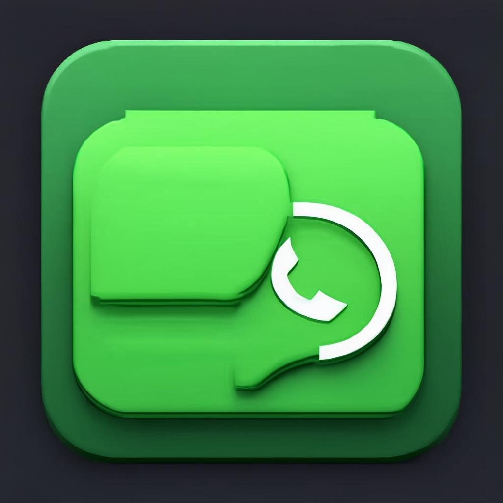

# StatusHub Pro: HD Story & Status Saver

<div align="center">



**A premium, fast, and beautiful WhatsApp Status Saver app for Android**

[](https://www.android.com)
[](https://kotlinlang.org)
[](https://developer.android.com/jetpack/compose)
[](https://android-arsenal.com/api?level=26)

</div>

---

## ✨ Features

### Core Features
- 📱 **Home Grid** - Auto-load statuses from WhatsApp folder with beautiful thumbnail grid
- 👁️ **Preview Screen** - Fullscreen swipeable preview with smooth animations
- 💾 **One-Tap Save** - Save statuses instantly to your device
- 📦 **Bulk Save** - Save multiple statuses at once with selection mode
- ❤️ **Favorites** - Mark and organize your favorite saved items
- 🔐 **Hidden Vault** - PIN-protected folder for private statuses (Premium)
- 💬 **Open WhatsApp FAB** - Launch WhatsApp directly from the app
- 🔄 **Auto Refresh** - Detect newly viewed statuses automatically

### Premium Features
- 🚫 **Ad-Free Experience** - Remove all advertisements
- 🔒 **Hidden Vault Access** - Secure folder with PIN protection
- ⚡ **Priority Support** - Faster response to issues
- 🚀 **Faster Loading** - Preloaded thumbnails for smoother experience

---

## 🏗️ Architecture

The app follows **MVVM + Repository Pattern** with modern Android development practices:

```
├── UI Layer (Jetpack Compose)
│   ├── Screens (Home, Preview, Saved, Settings, Vault)
│   ├── ViewModels
│   └── Navigation
│
├── Domain Layer
│   └── Use Cases
│
├── Data Layer
│   ├── Repository
│   ├── FileManager
│   └── Local Storage (Room + DataStore)
│
└── Services
    └── AdMob Service
```

### Tech Stack
| Component | Technology |
|-----------|------------|
| UI | Jetpack Compose, Material 3 |
| Architecture | MVVM + Repository Pattern |
| Dependency Injection | Hilt |
| Database | Room |
| Preferences | DataStore |
| Image Loading | Coil |
| Video Playback | Media3 ExoPlayer |
| Animations | Lottie |
| Ads | Google AdMob |
| CI/CD | Codemagic |

---

## 🚀 Getting Started

### Prerequisites
- Android Studio Hedgehog (2023.1.1) or newer
- JDK 17
- Android SDK 34
- Gradle 8.5

### Setup

1. **Clone the repository**
   ```bash
   git clone https://github.com/yourusername/StatusHubPro.git
   cd StatusHubPro
   ```

2. **Create keystore for release builds**
   ```bash
   cp keystore.properties.example keystore.properties
   # Edit keystore.properties with your keystore details
   ```

3. **Add Lottie animations** (required)
   - Download or create the following animations from [LottieFiles](https://lottiefiles.com):
     - `loading_animation.json`
     - `empty_state.json`
     - `onboarding_welcome.json`
     - `onboarding_how_it_works.json`
     - `onboarding_save.json`
     - `onboarding_vault.json`
     - `save_success.json`
     - `refresh.json`
   - Place them in `app/src/main/res/raw/`

4. **Build the project**
   ```bash
   ./gradlew assembleDebug
   ```

### Running on Device
1. Enable USB debugging on your Android device
2. Connect your device via USB
3. Run from Android Studio or use:
   ```bash
   ./gradlew installDebug
   ```

---

## 📁 Project Structure

```
StatusHubPro/
├── app/
│   ├── src/main/
│   │   ├── java/com/statushub/app/
│   │   │   ├── data/
│   │   │   │   ├── filemanager/      # File operations
│   │   │   │   ├── local/            # Database & Preferences
│   │   │   │   ├── model/            # Data models
│   │   │   │   └── repository/       # Data repository
│   │   │   ├── di/                   # Hilt modules
│   │   │   ├── services/             # AdMob service
│   │   │   ├── ui/
│   │   │   │   ├── components/       # Reusable UI components
│   │   │   │   ├── navigation/       # Navigation setup
│   │   │   │   ├── screens/          # Screen composables
│   │   │   │   ├── theme/            # Material 3 theme
│   │   │   │   └── viewmodel/        # ViewModels
│   │   │   ├── utils/                # Utility classes
│   │   │   ├── MainActivity.kt
│   │   │   └── StatusHubApplication.kt
│   │   ├── res/
│   │   │   ├── drawable/             # Vector drawables
│   │   │   ├── raw/                  # Lottie animations
│   │   │   ├── values/               # Strings, colors, themes
│   │   │   └── xml/                  # FileProvider paths
│   │   └── AndroidManifest.xml
│   └── build.gradle.kts
├── gradle/wrapper/
├── build.gradle.kts
├── codemagic.yaml
├── settings.gradle.kts
└── README.md
```

---

## 🎨 Design System

### Colors
| Element | Light Theme | Dark Theme |
|---------|-------------|------------|
| Background | `#FAFAFA` | `#0F0F0F` |
| Surface | `#FFFFFF` | `#1A1A1A` |
| Primary | `#25D366` | `#25D366` |
| On Background | `#1A1A1A` | `#FFFFFF` |
| On Surface Variant | `#757575` | `#B0B0B0` |

### Typography
- Uses Material 3 type scale
- Optimized for readability
- Supports dynamic type sizes

### Components
- Rounded corners (12dp default)
- Smooth animations (300ms)
- Haptic feedback on interactions
- Accessibility support

---

## 🔐 Permissions

| Permission | Purpose |
|------------|---------|
| `READ_MEDIA_IMAGES` | Read image statuses (Android 13+) |
| `READ_MEDIA_VIDEO` | Read video statuses (Android 13+) |
| `READ_EXTERNAL_STORAGE` | Read statuses (Android 12 and below) |
| `INTERNET` | AdMob ads |
| `VIBRATE` | Haptic feedback |
| `USE_BIOMETRIC` | Vault biometric unlock (optional) |

---

## 📱 Screenshots

| Home Screen | Preview Screen | Saved Screen |
|-------------|----------------|--------------|
| *Status grid* | *Fullscreen preview* | *Saved items* |

| Onboarding | Settings | Vault |
|------------|----------|-------|
| *Welcome flow* | *App preferences* | *PIN protected* |

---

## 🔄 CI/CD with Codemagic

The project includes Codemagic configuration for automated builds:

### Debug Build
- Triggered on: `develop`, `feature/*`, `bugfix/*` branches
- Output: Debug APK
- Duration: ~10 minutes

### Release Build
- Triggered on: `main`, `release/*` branches or version tags
- Output: Release APK + AAB
- Includes: ProGuard obfuscation, signing

### Setup Codemagic
1. Connect your repository to [Codemagic](https://codemagic.io)
2. Add environment variables:
   - `STATUSHUB_RELEASE_KEYSTORE` - Base64 encoded keystore
   - `CM_KEYSTORE_PASSWORD` - Keystore password
   - `CM_KEY_ALIAS` - Key alias
   - `CM_KEY_PASSWORD` - Key password
3. Update `codemagic.yaml` with your email

---

## 🧪 Testing

```bash
# Run unit tests
./gradlew test

# Run instrumented tests
./gradlew connectedAndroidTest

# Generate coverage report
./gradlew jacocoTestReport
```

---

## 📝 Play Store Checklist

- [ ] Replace test AdMob IDs with production IDs
- [ ] Add privacy policy URL
- [ ] Add app screenshots (phone, tablet)
- [ ] Write app description
- [ ] Add content rating questionnaire
- [ ] Set up app signing
- [ ] Configure in-app purchases (for premium)

---

## 🔧 Configuration

### AdMob Test IDs
The app uses AdMob test IDs by default. Replace these in `build.gradle.kts` for production:

```kotlin
buildConfigField("String", "ADMOB_APP_OPEN_ID", "\"your-production-id\"")
buildConfigField("String", "ADMOB_INTERSTITIAL_ID", "\"your-production-id\"")
buildConfigField("String", "ADMOB_REWARDED_ID", "\"your-production-id\"")
```

### Premium Configuration
For development testing, premium is enabled by default in debug builds. For release:
- Implement Firebase subscription management
- Update `PreferencesManager.setPremium()` to sync with backend

---

## 🤝 Contributing

1. Fork the repository
2. Create your feature branch (`git checkout -b feature/amazing-feature`)
3. Commit your changes (`git commit -m 'Add amazing feature'`)
4. Push to the branch (`git push origin feature/amazing-feature`)
5. Open a Pull Request

---

## 📄 License

This project is proprietary software. All rights reserved.

---

## ⚠️ Disclaimer

This app is **not affiliated with WhatsApp**. It only accesses locally stored status files from the user's device. Users are responsible for ensuring they have permission to save and share any content.

---

## 📞 Support

For support, email support@statushub.app or open an issue in this repository.

---

<div align="center">

**Made with ❤️ for Android users**

</div>
